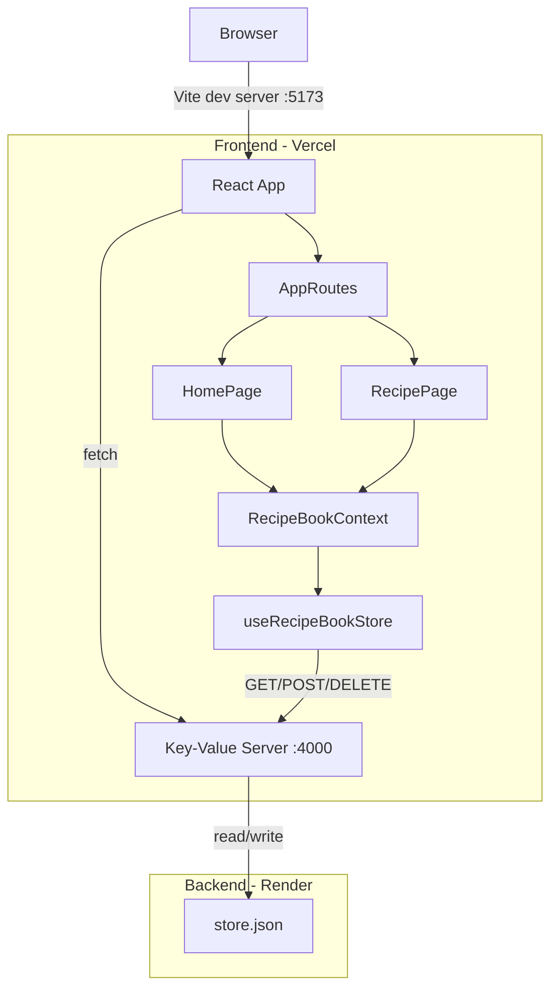

# Recipe Composer

A recipe book web app where users can create, edit, and view recipes and ingredients. Recipes can contain other recipes (recursive composition). Built with React, TypeScript, and Vite.

## Live Deployments

| Service | URL |
|---------|-----|
| Frontend (Vercel) | [recipe-composer.vercel.app](https://recipe-composer-kritikadangwals-projects.vercel.app) |
| Backend (Render) | [recipe-composer-api.onrender.com](https://recipe-composer-api.onrender.com) |

> **Note:** The Render free tier spins down after 15 min of inactivity. First request may take ~30s.

## Architecture



### Data Model

The recipe book is a flat dictionary where each entry is either an **Ingredient** or a **Recipe**:

```
Ingredient: { name, image?, states?, units? }
Recipe:     { name, image?, components: [{ id, qty, unit?, state? }] }
```

Recipes reference other entries by `id`. This forms a DAG (directed acyclic graph) — the app prevents circular dependencies at edit time.

## Project Structure

```
recipe-ui/
  server/server.js          # Key-value store (Node.js, no dependencies)
  app/                      # React frontend
    src/
      api/client.ts         # Typed API client with ApiResult pattern
      context/              # RecipeBookContext (shared state via React Context)
      hooks/                # useRecipeBookStore (CRUD + persistence)
      types/recipe.ts       # TypeScript types + isRecipe type guard
      utils/recipeUtils.ts  # flattenIngredients, cycle detection, helpers
      components/           # RecipeCard, RecipeTree, RecipeForm, Toast, etc.
      pages/HomePage.tsx    # List view with search, filter, CRUD
      routes/AppRoutes.tsx  # Route definitions
      tests/                # Vitest + Testing Library
```

## Setup

```bash
# 1. Start the backend
npm run server

# 2. Install frontend dependencies and start dev server
cd app && npm install && npm run dev
```

Open [http://localhost:5173](http://localhost:5173). Import `task/recipes.json` to seed sample data.

## Tests

```bash
cd app && npm test
```


**72 tests** across 10 files:

| File | Tests | Covers |
|------|-------|--------|
| `recipe.test.ts` | 4 | `isRecipe` type guard |
| `recipeUtils.test.ts` | 19 | Flatten ingredients, cycle detection, helpers |
| `api.test.ts` | 7 | API client GET/POST/DELETE, error handling |
| `RecipeCard.test.tsx` | 11 | Card rendering, badges, pills, images, click handlers |
| `RecipeTree.test.tsx` | 8 | Recursive tree, expand/collapse, missing items |
| `FlatList.test.tsx` | 6 | Multi-unit quantity formatting |
| `Toast.test.tsx` | 6 | Toast types, auto-dismiss, manual close |
| `ImportExport.test.tsx` | 5 | JSON import validation, export |
| `RecipeBookContext.test.tsx` | 1 | Context throws outside provider |
| `App.test.tsx` | 1 | Smoke test (loading state) |

CI runs on every push via [GitHub Actions](.github/workflows/ci.yml).

## Key Features

- **Recursive recipe composition** — recipes can contain other recipes, visualized as an expandable tree
- **Total ingredients resolver** — flattens nested recipes into a shopping list, grouping by unit (`600 ml + 1 cup`)
- **Circular dependency detection** — prevents invalid recipe references at edit time
- **Import/Export** — JSON import merges with existing data, export downloads the full book
- **Measurement units & states** — defined on ingredients, selected when used in recipes
- **Image support** — optional image URL per entry, with default fallback
- **Toast notifications** — success/error/info feedback on all operations
- **API error handling** — result-based pattern (`{ data, error }`) with pessimistic updates

## Tech Stack

React 19 | TypeScript | Vite | React Router | Vitest | Testing Library
